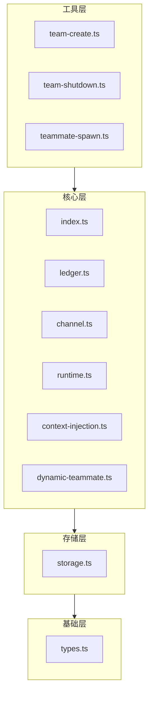

# OpenClaw Agent Team

> OpenClaw 多智能体团队协作插件，支持共享任务账本和智能体间消息传递。

[](https://www.typescriptlang.org/)
[](https://nodejs.org)
[](LICENSE)
[](https://twitter.com/FradSer)

[English](README.md) | [简体中文](README.zh-CN.md)

## 概述

`@fradser/openclaw-agent-team` 是一个 OpenClaw 插件，通过以下功能实现复杂的多智能体协作：

- **团队管理** — 创建和管理协同工作的 AI 智能体团队
- **任务账本** — 基于 JSONL 的共享任务跟踪，支持依赖管理
- **智能体间消息传递** — 通过 `agent-team` 频道实现队友间的直接通信
- **动态生成** — 按需生成新的智能体队友，支持自定义配置
- **工作空间隔离** — 每个队友拥有独立的工作空间和智能体目录

## 功能特性

- **3 个智能体工具**：`team_create`、`team_shutdown`、`teammate_spawn`
- **JSONL 持久化**：轻量级的仅追加存储，用于任务和成员数据
- **依赖跟踪**：任务依赖关系管理，支持循环依赖检测
- **频道插件**：内置 `agent-team` 消息频道，用于队友通信
- **上下文注入**：通过 `before_prompt_build` 钩子自动注入队友上下文
- **容量管理**：可配置的团队规模限制（1-50 个队友）
- **路径遍历保护**：安全的文件操作和验证机制
- **TypeBox 验证**：所有数据结构的运行时模式验证

## 安装

### 前置要求

- Node.js >= 20.0.0
- OpenClaw >= 2026.3.2
- pnpm（推荐）

### 从 npm 安装

```bash
openclaw plugins install @fradser/openclaw-agent-team
```

### 从源码安装

```bash
git clone https://github.com/FradSer/openclaw-agent-team.git
cd openclaw-agent-team
pnpm install
pnpm build
```

### 配置 OpenClaw

在 OpenClaw 配置中添加：

```json
{
  "plugins": [
    {
      "id": "openclaw-agent-team",
      "config": {
        "maxTeammatesPerTeam": 10,
        "defaultAgentType": "general-purpose",
        "teamsDir": "~/.openclaw/teams"
      }
    }
  ],
  "tools": {
    "sessions": {
      "visibility": "all"
    },
    "agentToAgent": {
      "enabled": true,
      "allow": [
        "*"
      ]
    }
  }
}
```

> **重要提示**：必须将 `tools.agentToAgent.enabled` 配置设置为 `true` 才能允许智能体间消息传递，并且 `tools.sessions.visibility` 必须为 `"all"`，以便队友之间能够互相看到。

## 使用指南

用户不需要手动编写和调用 JSON 格式的工具指令。插件安装并配置完成后，你只需用自然语言要求主智能体创建一个团队即可。

主智能体会作为“团队领导（Team Leader）”，自动调用底层工具去动态创建团队、生成队友、分配任务并与他们交流。

**示例提示词：**

- `"创建一个智能体团队来调研最新的 AI 模型并撰写报告。我需要一个 researcher 和一个 writer。"`
- `"生成一个团队来帮我重构这个项目。让一个智能体负责阅读代码并提出修改建议，另一个负责写测试。"`
- `"我们来构建一个 Web 应用程序。创建一个前端开发者智能体和一个后端开发者智能体，让他们在团队里协同工作。"`

## 快速开始（底层调用示例）

### 1. 创建团队

```typescript
// 智能体使用 team_create 工具
{
  "tool": "team_create",
  "input": {
    "team_name": "research-team",
    "description": "用于研究和分析任务的团队",
    "agent_type": "researcher"
  }
}
```

### 2. 生成队友

```typescript
// 生成一个队友
{
  "tool": "teammate_spawn",
  "input": {
    "team_name": "research-team",
    "name": "analyst-1",
    "agent_type": "data-analyst",
    "model": "claude-opus-4-6"
  }
}
```

### 3. 发送消息

```typescript
// 使用 agent-team 频道
{
  "channel": "agent-team",
  "target": "research-team:analyst-1",
  "message": "请分析最新的数据集"
}
```

### 4. 关闭团队

```typescript
// 优雅地关闭并清理
{
  "tool": "team_shutdown",
  "input": {
    "team_name": "research-team",
    "reason": "项目已完成"
  }
}
```

## 工作原理

`@fradser/openclaw-agent-team` 插件与 OpenClaw 的运行时（Runtime）深度集成，以实现多智能体协作：

1. **创建团队 (`team_create`)**：当智能体调用 `team_create` 工具时，插件会在 `~/.openclaw/teams/` 下创建一个专属的团队目录，并初始化 `config.json` 和基于 JSONL 的成员账本。
2. **动态生成队友 (`teammate_spawn`)**：调用 `teammate_spawn` 工具时，插件会验证请求并创建一个新的 OpenClaw 会话（子智能体）。至关重要的是，它会将这个新智能体**绑定 (Bind)** 到 OpenClaw 运行时（使用 `runtime.agents.set(...)`），动态注入其会话密钥、工具和配置，使得新队友能够立即在同一个 OpenClaw 守护进程内运行。
3. **上下文注入**：通过 `before_prompt_build` 钩子，插件会自动将团队意识注入到每个队友的提示词中。这使得智能体能直观地了解自己的角色、当前活跃的团队成员以及如何与他人沟通。
4. **智能体间消息传递**：内置的 `agent-team` 频道插件允许智能体使用 `teamName:teammateName` 格式互相寻址。消息会追加写入到团队收件箱中各自的 `messages.jsonl` 文件中，随后 OpenClaw 会安全地将这些消息路由到目标智能体进程中。

## 架构

插件遵循 4 层架构，依赖关系严格向内：



### 层级职责

- **基础层**：TypeBox 模式、验证、常量
- **存储层**：文件系统操作、目录管理、配置 I/O
- **核心层**：业务逻辑、账本操作、消息传递、运行时管理
- **工具层**：面向智能体的工具实现

## API 参考

### team_create

创建一个具有唯一名称的新团队。

**输入模式：**

```typescript
{
  team_name: string;      // 1-50 字符，小写字母数字和连字符
  description?: string;   // 可选的团队描述
  agent_type?: string;    // 可选的默认智能体类型
}
```

**返回值：**

```typescript
{
  teamId: string;         // 生成的 UUID
  teamName: string;       // 规范化的团队名称
  status: "active";       // 团队状态
}
```

**错误代码：**
- `DUPLICATE_TEAM_NAME` — 团队已存在
- `INVALID_TEAM_NAME` — 名称验证失败
- `TEAM_NAME_TOO_LONG` — 名称超过 50 字符
- `EMPTY_TEAM_NAME` — 名称为空

### teammate_spawn

在现有团队中生成新的智能体队友。

**输入模式：**

```typescript
{
  team_name: string;      // 现有团队名称
  name: string;           // 队友名称（自动清理）
  agent_type?: string;    // 可选的智能体类型覆盖
  model?: string;         // 可选的模型覆盖
  tools?: {               // 可选的工具限制
    allow?: string[];     // 允许的工具白名单
    deny?: string[];      // 拒绝的工具黑名单
  };
}
```

**返回值：**

```typescript
{
  agentId: string;        // 格式："teammate:{teamName}:{name}"
  sessionKey: string;     // 格式："agent:{agentId}:main"
  status: "idle";         // 初始状态
}
```

**错误代码：**
- `TEAM_NOT_FOUND` — 团队不存在
- `TEAM_NOT_ACTIVE` — 团队已关闭
- `TEAM_AT_CAPACITY` — 已达到最大队友数
- `DUPLICATE_TEAMMATE_NAME` — 名称已被使用
- `INVALID_TEAMMATE_NAME` — 名称验证失败

### team_shutdown

优雅地关闭团队并删除所有数据。

**输入模式：**

```typescript
{
  team_name: string;      // 要关闭的团队
  reason?: string;        // 可选的关闭原因
}
```

**返回值：**

```typescript
{
  teamName: string;       // 已关闭的团队名称
  status: "shutdown";     // 最终状态
  teammatesShutdown: number;  // 已关闭的队友数量
}
```

**错误代码：**
- `TEAM_NOT_FOUND` — 团队不存在
- `TEAM_ALREADY_SHUTDOWN` — 团队已关闭

## 配置

通过 OpenClaw 的插件配置来配置插件：

| 选项 | 类型 | 默认值 | 描述 |
|------|------|--------|------|
| `maxTeammatesPerTeam` | number | 10 | 每个团队的最大队友数（1-50）|
| `defaultAgentType` | string | "general-purpose" | 队友的默认智能体类型 |
| `teamsDir` | string | "~/.openclaw/teams" | 团队数据存储目录 |

**示例：**

```json
{
  "plugins": [
    {
      "id": "openclaw-agent-team",
      "config": {
        "maxTeammatesPerTeam": 20,
        "defaultAgentType": "specialist",
        "teamsDir": "/custom/path/teams"
      }
    }
  ]
}
```

## 数据存储

团队存储在 `~/.openclaw/teams/{team-name}/`（或自定义的 `teamsDir`）：

```
{team-name}/
├── config.json                        # TeamConfig JSON
├── tasks.jsonl                        # 任务记录（每行一个 JSON）
├── members.jsonl                      # 队友成员记录
├── dependencies.jsonl                 # 任务依赖边
├── agents/
│   └── {teammateName}/               # 队友工作空间目录
│       ├── workspace/                 # 智能体工作目录
│       └── agent/                     # 智能体目录
└── inbox/
    └── {teammateName}/
        └── messages.jsonl             # 队友的入站消息
```

### JSONL 格式

所有账本文件使用 JSONL（JSON Lines）格式，以实现高效的仅追加操作：

```jsonl
{"id":"task-1","subject":"Research","status":"pending","createdAt":"2026-03-05T10:00:00Z"}
{"id":"task-2","subject":"Analysis","status":"in_progress","owner":"analyst-1","createdAt":"2026-03-05T10:05:00Z"}
```

## 开发

### 设置

```bash
# 克隆仓库
git clone https://github.com/FradSer/openclaw-agent-team.git
cd openclaw-agent-team

# 安装依赖
pnpm install

# 构建
pnpm build
```

### 测试

```bash
# 运行所有测试
pnpm test

# 在监视模式下运行测试
pnpm test:watch

# 运行特定测试文件
cd packages/openclaw-agent-team
pnpm vitest run tests/ledger.test.ts
```

### 代码检查

```bash
pnpm lint
```

### 项目结构

```
openclaw-agent-team/
├── package.json                  # Monorepo 根目录
├── pnpm-workspace.yaml           # 工作空间配置
├── CLAUDE.md                     # 开发文档
├── README.md                     # 英文文档
├── README.zh-CN.md               # 中文文档
└── packages/
    └── openclaw-agent-team/      # 主插件包
        ├── package.json
        ├── tsconfig.json
        ├── vitest.config.ts
        ├── openclaw.plugin.json  # 插件清单
        ├── index.ts              # 重新导出
        ├── src/                  # 源文件
        │   ├── index.ts          # 插件入口点
        │   ├── types.ts          # TypeBox 模式
        │   ├── storage.ts        # 文件操作
        │   ├── ledger.ts         # 任务/成员持久化
        │   ├── channel.ts        # 消息频道
        │   ├── runtime.ts        # 运行时单例
        │   ├── context-injection.ts  # 上下文钩子
        │   ├── dynamic-teammate.ts   # 生成逻辑
        │   └── tools/            # 工具实现
        └── tests/                # 测试文件
```

## 贡献

欢迎贡献！请遵循以下指南：

### 提交格式

```
<type>(<scope>): <description>
```

**类型**：`feat`、`fix`、`docs`、`refactor`、`test`、`chore`、`perf`、`style`

**范围**：`plugin`、`team`、`task`、`agent`、`msg`、`coord`、`config`、`deps`、`ci`、`docs`

### 分支命名

- `feature/*` — 新功能
- `fix/*` — 错误修复
- `hotfix/*` — 紧急修复
- `refactor/*` — 代码重构
- `docs/*` — 文档更新

### 测试要求

- 所有新功能必须包含测试
- 保持测试覆盖率在 80% 以上
- 遵循 BDD 原则，使用 Given/When/Then 场景

## 许可证

MIT License

Copyright (c) 2026 Frad LEE

## 作者

**Frad LEE**
- 邮箱：fradser@gmail.com
- GitHub：[@FradSer](https://github.com/FradSer)

## 链接

- [代码仓库](https://github.com/FradSer/openclaw-agent-team)
- [问题反馈](https://github.com/FradSer/openclaw-agent-team/issues)
- [OpenClaw 文档](https://openclaw.dev)