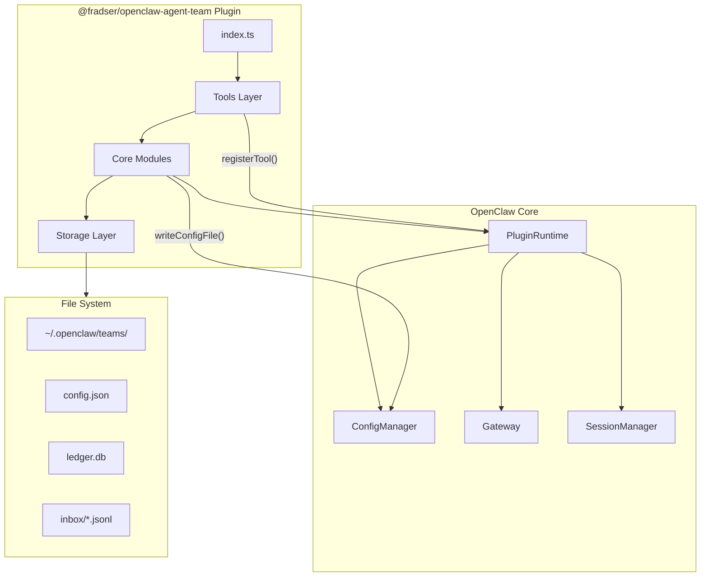
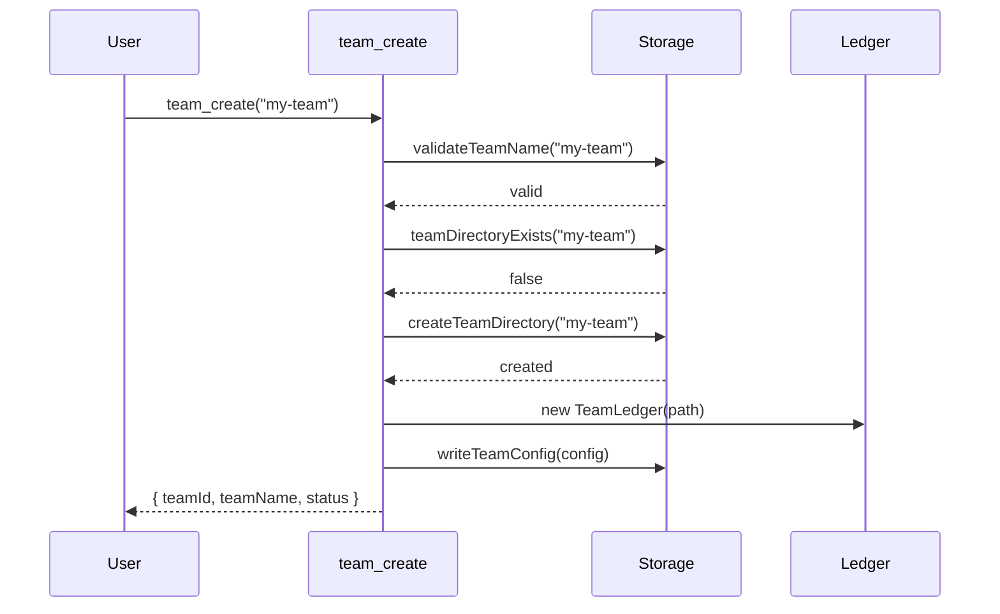
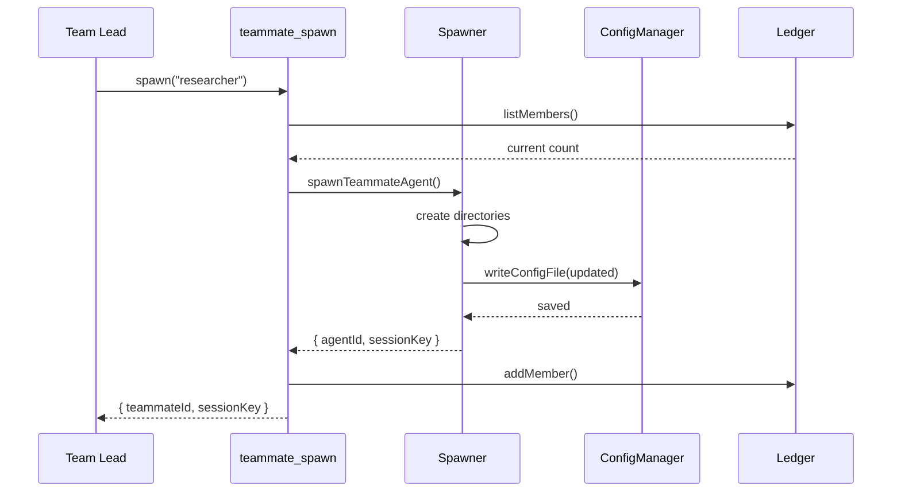
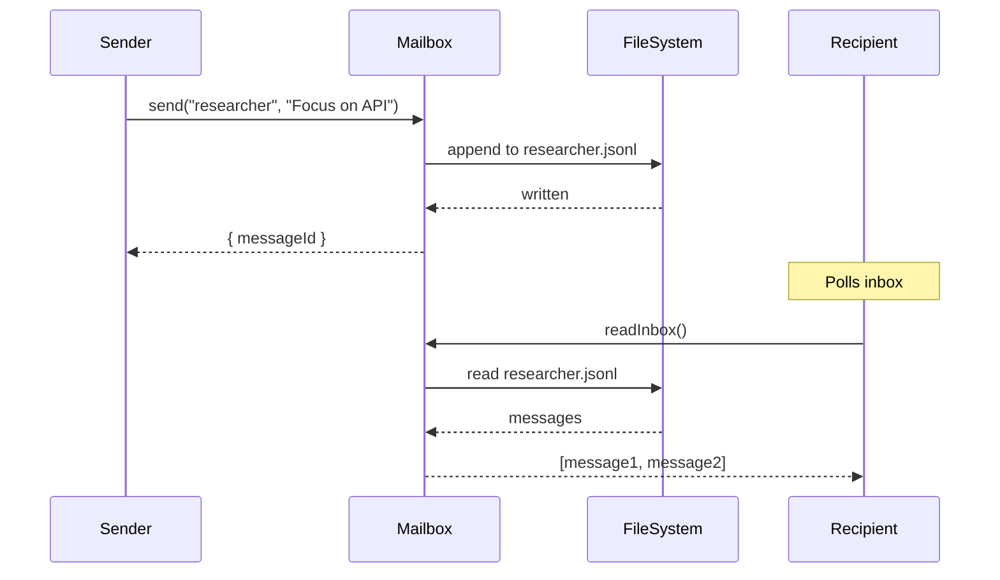

# Architecture

## System Overview



## Component Details

### 1. Plugin Entry Point (index.ts)

**Responsibility**: Register tools, services, and hooks with OpenClaw.

```typescript
// index.ts
const agentTeamPlugin = {
  id: "agent-team",
  name: "Agent Team",
  description: "Multi-agent team coordination with shared task ledger",
  configSchema: AgentTeamConfigSchema,

  async register(api: OpenClawPluginApi) {
    const ctx = createPluginContext(api);

    // Register agent tools
    registerTeamTools(api, ctx);

    // Register background service for cleanup
    api.registerService(createCleanupService(ctx));

    // Register hooks for context injection
    api.on("before_prompt_build", injectTeamContext(ctx));

    api.logger.info("[agent-team] Plugin registered");
  },
};

export default agentTeamPlugin;
```

### 2. Types (src/types.ts)

```typescript
// Core type definitions
export interface TeamConfig {
  id: string;
  team_name: string;
  description?: string;
  agent_type: string;
  lead: string;
  metadata: {
    createdAt: number;
    updatedAt: number;
    status: "active" | "shutdown";
  };
}

export interface TeammateDefinition {
  name: string;
  agentId: string;
  sessionKey: string;
  agentType: string;
  model?: string;
  tools?: {
    allow?: string[];
    deny?: string[];
  };
  status: "idle" | "working" | "error" | "shutdown";
  joinedAt: number;
}

export interface Task {
  id: string;
  subject: string;
  description: string;
  activeForm?: string;
  status: "pending" | "in_progress" | "completed" | "failed" | "blocked";
  owner?: string;
  blockedBy: string[];
  createdAt: number;
  claimedAt?: number;
  completedAt?: number;
}

export interface TeamMessage {
  id: string;
  from: string;
  to?: string;
  type: "message" | "broadcast" | "task_update" | "shutdown_request";
  content: string;
  summary?: string;
  timestamp: number;
}
```

### 3. Storage Layer (src/storage.ts)

**Responsibility**: Manage team directories, config files, and path resolution.

```typescript
// Key functions
export function getTeamsBaseDir(): string;
export async function createTeamDirectory(teamsDir: string, teamName: string): Promise<void>;
export async function teamDirectoryExists(teamsDir: string, teamName: string): Promise<boolean>;
export function validateTeamName(name: string): boolean;
export async function writeTeamConfig(teamsDir: string, teamName: string, config: TeamConfig): Promise<void>;
export async function readTeamConfig(teamsDir: string, teamName: string): Promise<TeamConfig | null>;

// Teammate path resolution
export function resolveTeammatePaths(teamsDir: string, teamName: string, teammateName: string): {
  workspace: string;
  agentDir: string;
  inboxPath: string;
};
```

### 4. SQLite Ledger (src/ledger.ts)

**Responsibility**: Persist tasks, members, and team state with ACID guarantees.

```typescript
export class TeamLedger {
  private db: Database;

  constructor(dbPath: string) {
    this.db = new Database(dbPath);
    this.db.pragma("journal_mode = WAL");
    this.initializeTables();
  }

  // Task operations
  createTask(task: Omit<Task, "id" | "createdAt">): Task;
  getTask(taskId: string): Task | null;
  listTasks(filter?: TaskFilter): Task[];
  updateTaskStatus(taskId: string, status: TaskStatus, owner?: string): boolean;
  deleteTask(taskId: string): boolean;

  // Member operations
  addMember(member: TeammateDefinition): void;
  listMembers(): TeammateDefinition[];
  updateMemberStatus(sessionKey: string, status: string): boolean;
  removeMember(sessionKey: string): boolean;

  // Dependency operations
  getBlockingTasks(taskId: string): Task[];
  getDependentTasks(taskId: string): Task[];
  isTaskBlocked(taskId: string): boolean;

  // Close
  close(): void;
}
```

**Database Schema**:

```sql
CREATE TABLE tasks (
  id TEXT PRIMARY KEY,
  subject TEXT NOT NULL,
  description TEXT,
  active_form TEXT,
  status TEXT NOT NULL DEFAULT 'pending',
  owner TEXT,
  created_at INTEGER NOT NULL,
  claimed_at INTEGER,
  completed_at INTEGER
);

CREATE TABLE task_dependencies (
  task_id TEXT NOT NULL,
  blocks_task_id TEXT NOT NULL,
  PRIMARY KEY (task_id, blocks_task_id),
  FOREIGN KEY (task_id) REFERENCES tasks(id),
  FOREIGN KEY (blocks_task_id) REFERENCES tasks(id)
);

CREATE TABLE members (
  session_key TEXT PRIMARY KEY,
  name TEXT NOT NULL,
  agent_id TEXT NOT NULL,
  agent_type TEXT,
  status TEXT NOT NULL DEFAULT 'idle',
  joined_at INTEGER NOT NULL
);

CREATE INDEX idx_tasks_status ON tasks(status);
CREATE INDEX idx_tasks_owner ON tasks(owner);
CREATE INDEX idx_members_status ON members(status);
```

### 5. Mailbox System (src/mailbox.ts)

**Responsibility**: Route messages between agents via JSONL files.

```typescript
export class Mailbox {
  constructor(private teamsDir: string, private teamName: string) {}

  // Send message to specific recipient
  async sendDirectMessage(params: {
    from: string;
    to: string;
    content: string;
    summary?: string;
  }): Promise<TeamMessage>;

  // Broadcast to all teammates
  async broadcast(params: {
    from: string;
    content: string;
    summary?: string;
  }): Promise<TeamMessage[]>;

  // Read messages for a session
  async readInbox(sessionKey: string, options?: {
    limit?: number;
    clear?: boolean;
  }): Promise<TeamMessage[]>;

  // Internal
  private getInboxPath(sessionKey: string): string;
  private appendMessage(path: string, message: TeamMessage): Promise<void>;
}
```

**JSONL Format**:

```
{"id":"msg-001","from":"lead","to":"researcher","type":"message","content":"Focus on API","summary":"Task","timestamp":1709251200000}
{"id":"msg-002","from":"researcher","to":"lead","type":"task_update","content":"Task complete","summary":"Done","timestamp":1709251500000}
```

### 6. Teammate Spawner (src/teammate-spawner.ts)

**Responsibility**: Create full agent instances using Feishu pattern.

```typescript
export async function spawnTeammateAgent(params: {
  runtime: PluginRuntime;
  cfg: OpenClawConfig;
  teamName: string;
  teammateName: string;
  agentType: string;
  model?: string;
  tools?: { allow?: string[]; deny?: string[] };
}): Promise<{ agentId: string; sessionKey: string }> {
  const { runtime, cfg, teamName, teammateName, agentType, model, tools } = params;

  const teamsDir = getTeamsBaseDir();
  const sanitized = sanitizeTeammateName(teammateName);
  const agentId = `teammate-${teamName}-${sanitized}`;
  const sessionKey = `agent:${agentId}:main`;

  // Resolve paths
  const { workspace, agentDir } = resolveTeammatePaths(teamsDir, teamName, sanitized);

  // Create directories
  await fs.promises.mkdir(workspace, { recursive: true });
  await fs.promises.mkdir(path.join(agentDir, "sessions"), { recursive: true });

  // Build agent config
  const newAgent: AgentConfig = {
    id: agentId,
    workspace,
    agentDir,
    ...(model && { model: { primary: model } }),
    ...(tools && { tools }),
  };

  // Update global config
  const updatedCfg: OpenClawConfig = {
    ...cfg,
    agents: {
      ...cfg.agents,
      list: [...(cfg.agents?.list ?? []), newAgent],
    },
  };

  await runtime.config.writeConfigFile(updatedCfg);

  return { agentId, sessionKey };
}
```

### 7. Tools Layer (src/tools/)

Each tool follows the OpenClaw `AnyAgentTool` interface:

```typescript
// src/tools/teammate-spawn.ts
export function createTeammateSpawnTool(ctx: PluginContext): AnyAgentTool {
  return {
    label: "Teammate Spawn",
    name: "teammate_spawn",
    description: "Creates a new teammate agent with isolated workspace.",
    parameters: TeammateSpawnSchema,
    execute: async (_toolCallId, args) => {
      const params = args as Record<string, unknown>;

      // Validate team exists
      const teamName = readStringParam(params, "team_name", { required: true });
      if (!(await teamDirectoryExists(ctx.teamsDir, teamName))) {
        return jsonResult({ error: `Team '${teamName}' not found` });
      }

      // Check teammate limit
      const manager = getTeamManager(teamName, ctx.teamsDir);
      if (manager.listMembers().length >= ctx.config.maxTeammatesPerTeam) {
        return jsonResult({ error: "Team at maximum capacity" });
      }

      // Spawn agent
      const result = await spawnTeammateAgent({
        runtime: ctx.api.runtime,
        cfg: ctx.api.config,
        teamName,
        teammateName: readStringParam(params, "name", { required: true }),
        agentType: readStringParam(params, "agent_type") ?? ctx.config.defaultAgentType,
        model: readStringParam(params, "model"),
      });

      // Register in ledger
      await manager.addMember({
        name: params.name,
        agentId: result.agentId,
        sessionKey: result.sessionKey,
        agentType: params.agent_type ?? "member",
        status: "idle",
        joinedAt: Date.now(),
      });

      return jsonResult({
        teammateId: result.agentId,
        sessionKey: result.sessionKey,
        status: "spawned",
      });
    },
  };
}
```

## Data Flow

### Team Creation Flow



### Teammate Spawn Flow



### Message Delivery Flow



## Error Handling

### Error Categories

| Category | Handling Strategy |
|----------|-------------------|
| Validation | Return structured error with field and message |
| Not Found | Return 404-style error with resource type |
| Conflict | Return conflict error with current state |
| System | Log error, return generic message, suggest recovery |

### Error Response Format

```typescript
interface ToolError {
  error: string;
  code: "VALIDATION" | "NOT_FOUND" | "CONFLICT" | "SYSTEM";
  details?: Record<string, unknown>;
  suggestedAction?: string;
}
```

## Performance Considerations

### SQLite Optimization

- WAL mode for concurrent reads
- Prepared statements for repeated queries
- Batch inserts in transactions
- Regular VACUUM and ANALYZE

### JSONL Optimization

- Append-only writes (no file locking)
- Per-sender files to reduce contention
- Rotation at 10MB threshold
- Lazy cleanup during read operations

### Memory Management

- TeamManager pooling (reuse instances)
- Lazy loading of ledger on first access
- Periodic cleanup of stale resources