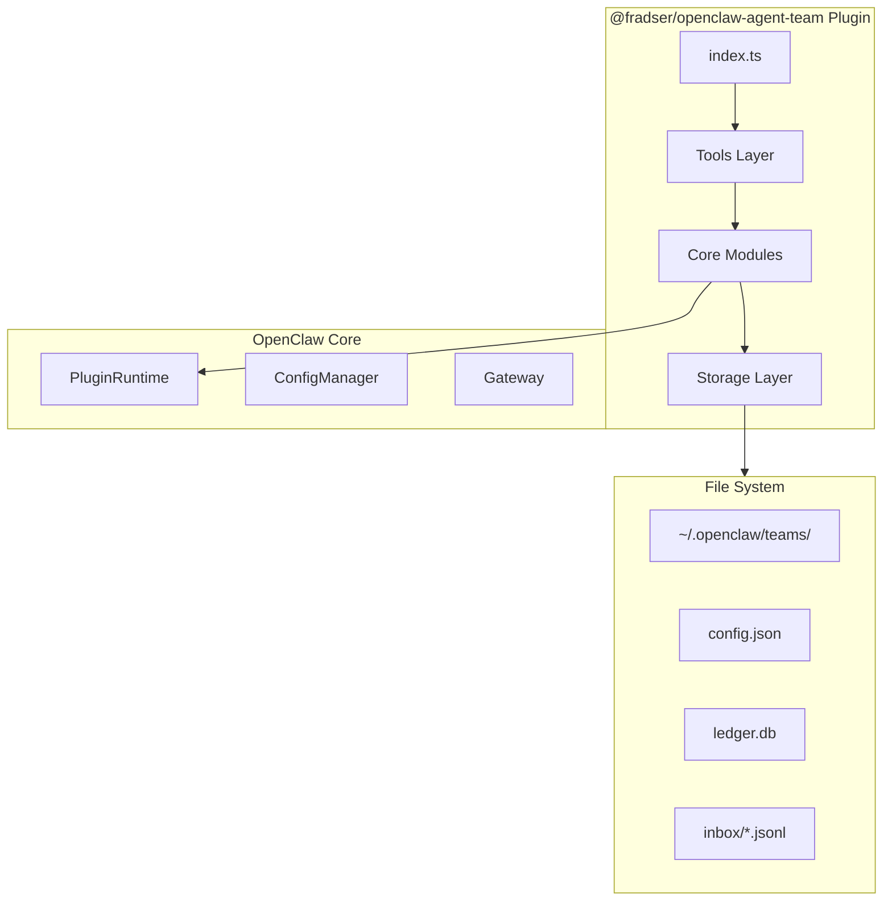
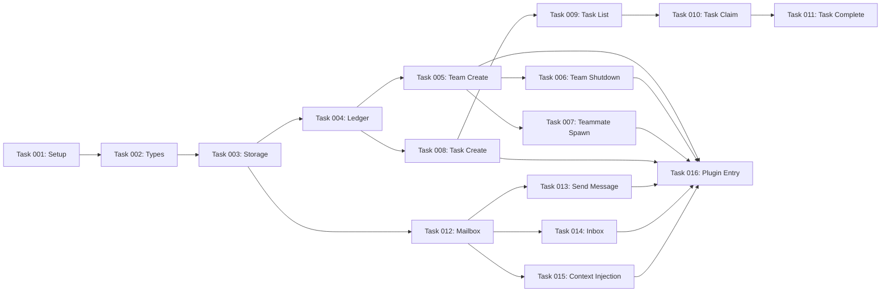

# Agent Team Plugin Implementation Plan

## Goal

Implement the `@fradser/openclaw-agent-team` plugin that enables multi-agent coordination in OpenClaw by creating full isolated agent instances per teammate with SQLite-based task ledger and JSONL-based inter-agent messaging.

## Architecture



## Constraints

1. **Isolation**: Each teammate has isolated workspace and agent directory
2. **Persistence**: SQLite for tasks, JSONL for messages - both survive restarts
3. **Message Delivery**: Heartbeat wake + context injection mechanism
4. **Security**: Input validation, path traversal prevention, file permissions
5. **Performance**: WAL mode for SQLite, append-only JSONL writes

## Implementation Phases

### Phase 1: Core Infrastructure (Tasks 001-004)
- Project setup and configuration
- Type definitions
- Storage layer (directory management, path resolution)
- SQLite ledger (task persistence)

### Phase 2: Team Management (Tasks 005-006)
- team_create tool
- team_shutdown tool

### Phase 3: Teammate Spawning (Task 007)
- teammate_spawn tool with agent configuration

### Phase 4: Task System (Tasks 008-011)
- task_create tool
- task_list tool
- task_claim tool
- task_complete tool

### Phase 5: Communication (Tasks 012-014)
- Mailbox module (JSONL messaging)
- send_message tool
- inbox tool

### Phase 6: Context Injection (Task 015)
- before_prompt_build hook for message delivery

### Phase 7: Plugin Integration (Task 016)
- Plugin entry point and tool registration

## Execution Plan

### Phase 1: Core Infrastructure

- [Task 001: Setup Project Structure](./task-001-setup-project-structure.md)
- [Task 002: Types Module Test](./task-002-types-test.md)
- [Task 002: Types Module Impl](./task-002-types-impl.md)
- [Task 003: Storage Module Test](./task-003-storage-test.md)
- [Task 003: Storage Module Impl](./task-003-storage-impl.md)
- [Task 004: SQLite Ledger Test](./task-004-ledger-test.md)
- [Task 004: SQLite Ledger Impl](./task-004-ledger-impl.md)

### Phase 2: Team Management

- [Task 005: Team Create Test](./task-005-team-create-test.md)
- [Task 005: Team Create Impl](./task-005-team-create-impl.md)
- [Task 006: Team Shutdown Test](./task-006-team-shutdown-test.md)
- [Task 006: Team Shutdown Impl](./task-006-team-shutdown-impl.md)

### Phase 3: Teammate Spawning

- [Task 007: Teammate Spawn Test](./task-007-teammate-spawn-test.md)
- [Task 007: Teammate Spawn Impl](./task-007-teammate-spawn-impl.md)

### Phase 4: Task System

- [Task 008: Task Create Test](./task-008-task-create-test.md)
- [Task 008: Task Create Impl](./task-008-task-create-impl.md)
- [Task 009: Task List Test](./task-009-task-list-test.md)
- [Task 009: Task List Impl](./task-009-task-list-impl.md)
- [Task 010: Task Claim Test](./task-010-task-claim-test.md)
- [Task 010: Task Claim Impl](./task-010-task-claim-impl.md)
- [Task 011: Task Complete Test](./task-011-task-complete-test.md)
- [Task 011: Task Complete Impl](./task-011-task-complete-impl.md)

### Phase 5: Communication

- [Task 012: Mailbox Module Test](./task-012-mailbox-test.md)
- [Task 012: Mailbox Module Impl](./task-012-mailbox-impl.md)
- [Task 013: Send Message Test](./task-013-send-message-test.md)
- [Task 013: Send Message Impl](./task-013-send-message-impl.md)
- [Task 014: Inbox Test](./task-014-inbox-test.md)
- [Task 014: Inbox Impl](./task-014-inbox-impl.md)

### Phase 6: Context Injection

- [Task 015: Context Injection Test](./task-015-context-injection-test.md)
- [Task 015: Context Injection Impl](./task-015-context-injection-impl.md)

### Phase 7: Plugin Integration

- [Task 016: Plugin Entry Point Test](./task-016-plugin-entry-test.md)
- [Task 016: Plugin Entry Point Impl](./task-016-plugin-entry-impl.md)

## Verification Strategy

Each task follows TDD (Test-Driven Development):

1. **Red Phase**: Write failing tests that define expected behavior
2. **Green Phase**: Implement minimum code to pass tests
3. **Refactor Phase**: Improve code quality while keeping tests green

### Test Categories

- **Unit Tests**: Each module tested in isolation with mock dependencies
- **Integration Tests**: Tool workflows with real file system operations
- **E2E Tests**: Full team lifecycle scenarios

### Running Tests

```bash
# Run all tests
pnpm test

# Run specific test file
pnpm test src/storage.test.ts

# Run with coverage
pnpm test --coverage
```

## Dependencies



## Design Reference

This plan is based on the design documents in `docs/plans/2026-03-01-agent-team-plugin-design/`:

- [Design Index](../2026-03-01-agent-team-plugin-design/_index.md)
- [BDD Specifications](../2026-03-01-agent-team-plugin-design/bdd-specs.md)
- [Architecture](../2026-03-01-agent-team-plugin-design/architecture.md)
- [Best Practices](../2026-03-01-agent-team-plugin-design/best-practices.md)
