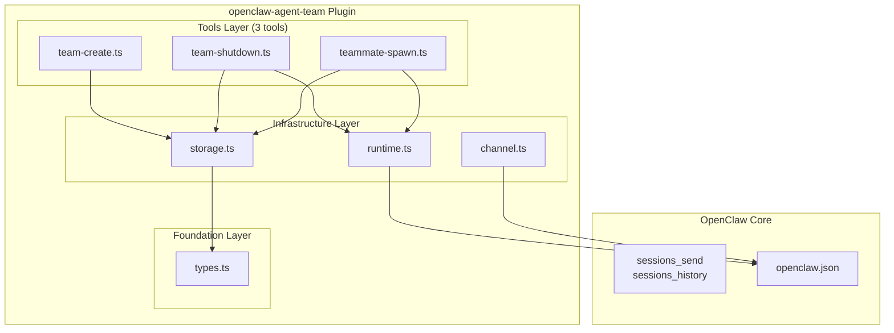
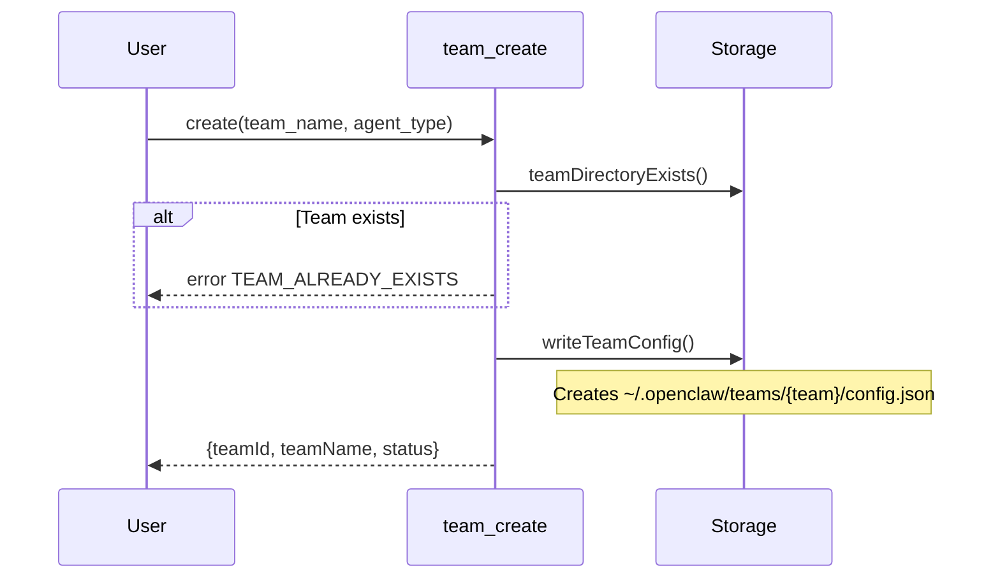
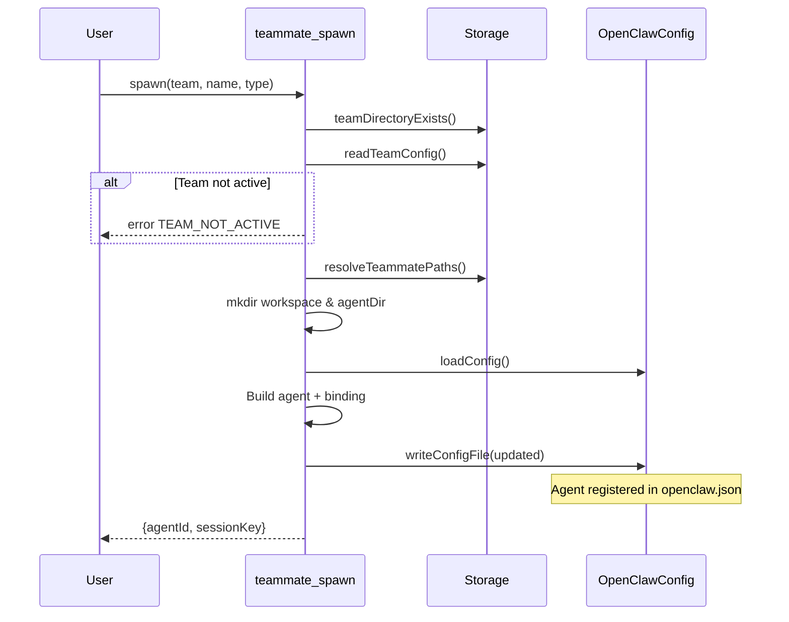
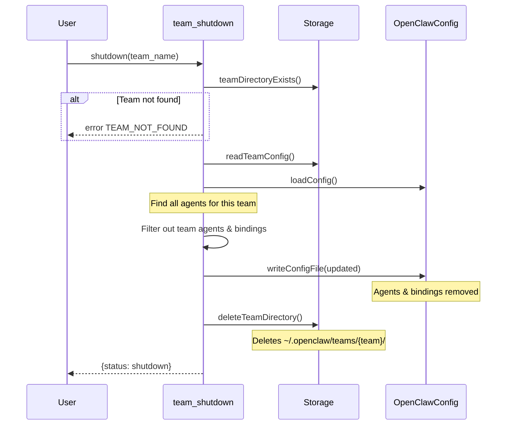
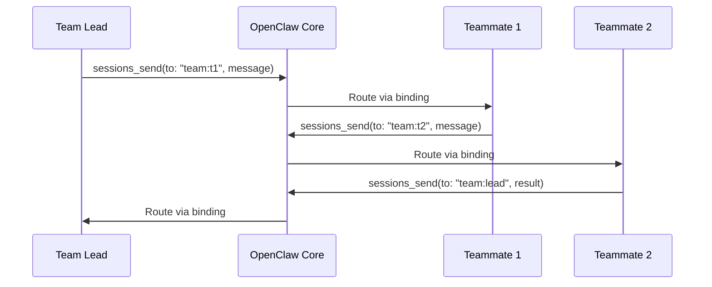

# Architecture

## Component Diagram



## File Structure

### Current (7 tools)

```
packages/openclaw-agent-team/src/
├── index.ts
├── types.ts
├── ledger.ts                     # REMOVE
├── storage.ts
├── runtime.ts
├── channel.ts
└── tools/
    ├── team-create.ts
    ├── team-shutdown.ts
    ├── teammate-spawn.ts
    ├── task-create.ts            # REMOVE
    ├── task-list.ts              # REMOVE
    ├── task-claim.ts             # REMOVE
    └── task-complete.ts          # REMOVE
```

### After Minimal Refactor (3 tools)

```
packages/openclaw-agent-team/src/
├── index.ts                      # Remove task tool imports
├── types.ts                      # Remove Task types
├── storage.ts                    # Keep (team directory management)
├── runtime.ts                    # Keep
├── channel.ts                    # Keep
└── tools/
    ├── team-create.ts            # Keep
    ├── team-shutdown.ts          # Keep
    └── teammate-spawn.ts         # Keep
```

## Sequence Diagrams

### Team Creation



### Teammate Spawn



### Team Shutdown



## Data Storage

### Team Directory Structure

```
~/.openclaw/teams/{team-name}/
├── config.json         # Team configuration
└── agents/
    └── {teammateName}/
        ├── workspace/  # Teammate workspace
        └── agent/      # Teammate agent config
```

### Config.json Schema

```json
{
  "id": "uuid",
  "team_name": "my-team",
  "description": "Optional description",
  "agent_type": "team-lead",
  "lead": "coordinator",
  "metadata": {
    "createdAt": 1234567890,
    "updatedAt": 1234567890,
    "status": "active"
  }
}
```

### OpenClaw Config Integration

```json
{
  "agents": {
    "list": [
      {
        "id": "teammate-my-team-researcher",
        "workspace": "~/.openclaw/teams/my-team/agents/researcher/workspace",
        "agentDir": "~/.openclaw/teams/my-team/agents/researcher/agent"
      }
    ]
  },
  "bindings": [
    {
      "agentId": "teammate-my-team-researcher",
      "match": {
        "channel": "agent-team",
        "peer": {
          "kind": "direct",
          "id": "my-team:researcher"
        }
      }
    }
  ]
}
```

## Types (Simplified)

```typescript
// Team Configuration
export const TeamConfigSchema = Type.Object({
  id: Type.String(),
  team_name: Type.String(),
  description: Type.Optional(Type.String()),
  agent_type: Type.String(),
  lead: Type.Optional(Type.String()),
  metadata: Type.Object({
    createdAt: Type.Number(),
    updatedAt: Type.Number(),
    status: Type.String(),
  }),
});

// Teammate Definition
export const TeammateDefinitionSchema = Type.Object({
  name: Type.String(),
  agentId: Type.String(),
  sessionKey: Type.String(),
  agentType: Type.String(),
  model: Type.Optional(Type.String()),
  tools: Type.Optional(TeammateToolsSchema),
  status: TeammateStatusSchema,
  joinedAt: Type.Number(),
});

// Plugin Configuration
export const AgentTeamConfigSchema = Type.Object({
  maxTeammatesPerTeam: Type.Number({ default: 10 }),
  defaultAgentType: Type.String({ default: "general-purpose" }),
  teamsDir: Type.Optional(Type.String()),
});
```

## Removed Types

| Type | Reason |
|------|--------|
| `Task` | Task management removed |
| `TaskStatus` | Task management removed |
| `TeamMessage` | Messaging removed (use core) |
| `SendMessageParams` | Messaging removed (use core) |

## Tool Count Comparison

| Version | Tools | Purpose |
|---------|-------|---------|
| Original | 9 | Full coordination + messaging |
| After refactor | 7 | Task coordination only |
| **Minimal** | **3** | **Agent lifecycle only** |

## Communication Flow

Teammates communicate directly via OpenClaw core:



No plugin messaging layer needed - OpenClaw handles all routing.
