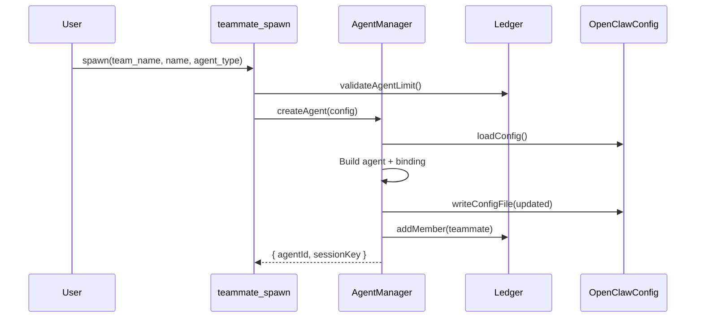
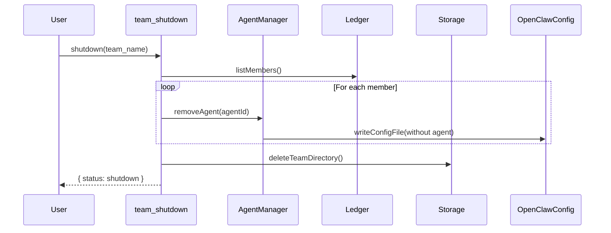

# openclaw-agent-team Plugin Refactor Design

## Context

The `openclaw-agent-team` plugin currently duplicates functionality that exists in OpenClaw core:
- `send_message` / `inbox` duplicate `sessions_send` and session history
- `Mailbox` class duplicates core message storage
- `teammate-invoker` and `reply-dispatcher` are complex workarounds

This refactor aims to:
1. Remove duplicate messaging, use core's `sessions_send`
2. Use `writeConfigFile` for dynamic agent creation with proper cleanup
3. Simplify the plugin to focus on its unique value: Team/Task management

## Requirements

### Functional Requirements

| ID | Requirement | Priority |
|----|-------------|----------|
| R1 | `team_create` creates team config in `~/.openclaw/teams/{team}/config.json` | Must |
| R2 | `team_shutdown` removes all agents/bindings from openclaw.json and cleans team directory | Must |
| R3 | `teammate_spawn` creates agent definition + binding in openclaw.json | Must |
| R4 | `teammate_remove` removes agent + binding from openclaw.json | Must |
| R5 | Messaging uses core's `sessions_send` instead of custom Mailbox (tools removed) | Must |
| R6 | Task management (create, list, claim, complete) remains unchanged | Must |
| R7 | Teammates are independent agents with proper routing via bindings | Must |

### Non-Functional Requirements

| ID | Requirement | Priority |
|----|-------------|----------|
| NF1 | Config updates must be atomic (use `writeConfigFile`) | Must |
| NF2 | Cleanup must be complete (no orphaned agents/bindings) | Must |
| NF3 | Plugin code size should reduce by ~50% | Should |

## Rationale

### Why use `writeConfigFile`?

The feishu extension demonstrates the pattern for dynamic agent creation. Using `writeConfigFile` ensures:
- Atomic config updates
- Consistency with OpenClaw's config management
- Proper reload behavior

### Why remove custom messaging?

OpenClaw core provides:
- `sessions_send` for point-to-point messaging with timeout
- `sessions_history` for viewing conversation history
- A2A negotiation flow (ping-pong turns)

The plugin's `Mailbox` duplicates this with less functionality.

### Why keep `team_create` separate from `teammate_spawn`?

- `team_create` - Creates team config (settings, metadata)
- `teammate_spawn` - Creates agent definitions and bindings

This separation allows:
- Team-level configuration before adding members
- Multiple teammates per team
- Clear lifecycle management

## Detailed Design

### Component Architecture

```
packages/openclaw-agent-team/src/
├── index.ts                    # Plugin entry point
├── types.ts                    # TypeBox schemas (updated)
│
├── core/
│   ├── ledger.ts              # Task/Member persistence (keep)
│   └── agent-manager.ts       # NEW: Dynamic agent lifecycle
│
├── channel/
│   └── agent-team-channel.ts  # Simplified channel plugin
│
├── tools/
│   ├── team-create.ts         # Config only
│   ├── team-shutdown.ts       # Cleanup via agent-manager
│   ├── teammate-spawn.ts      # Uses agent-manager
│   ├── teammate-remove.ts     # NEW: Remove single teammate
│   ├── task-create.ts         # Keep
│   ├── task-list.ts           # Keep
│   ├── task-claim.ts          # Keep
│   └── task-complete.ts       # Keep
│
├── storage.ts                 # Keep
└── runtime.ts                 # Keep
```

### Files to Delete

| File | Reason | Status |
|------|--------|--------|
| `mailbox.ts` | Replaced by sessions_send | DELETED |
| `teammate-invoker.ts` | Replaced by sessions_send | DELETED |
| `reply-dispatcher.ts` | Use core mechanisms | DELETED |
| `tools/send-message.ts` | Replaced by sessions_send | DELETED |
| `tools/inbox.ts` | Replaced by session history | DELETED |
| `context-injection.ts` | No longer needed | pending |

### Current Source Files (as of 2026-03-14)

```
packages/openclaw-agent-team/src/
├── index.ts                    # Plugin entry point
├── types.ts                    # TypeBox schemas
├── ledger.ts                   # Member persistence (JSONL)
├── storage.ts                  # Path resolution, directory ops
├── runtime.ts                  # PluginRuntime singleton
├── channel.ts                  # agent-team channel plugin
├── dynamic-teammate.ts         # Agent lifecycle (createAgent, repairBinding)
├── context-injection.ts        # before_prompt_build hook (pending deletion)
└── tools/
    ├── team-create.ts
    ├── team-shutdown.ts
    └── teammate-spawn.ts
```

`dynamic-teammate.ts` already implements the agent lifecycle pattern (`maybeSpawnTeammate`, `repairTeammateBinding`) using `runtime.config.loadConfig()` and `runtime.config.writeConfigFile()`. The planned `agent-manager.ts` would extract and formalize this interface.

### Key Interfaces

```typescript
// core/agent-manager.ts
interface DynamicAgentConfig {
  agentId: string;
  teamName: string;
  teammateName: string;
  agentType: string;
  workspace: string;
  agentDir: string;
  model?: string;
  tools?: { allow?: string[]; deny?: string[] };
}

interface AgentManager {
  createAgent(config: DynamicAgentConfig): Promise<{ agentId: string; sessionKey: string }>;
  removeAgent(agentId: string): Promise<void>;
  listTeamAgents(teamName: string): Promise<DynamicAgentConfig[]>;
}
```

### Data Flow

#### Teammate Spawn



#### Team Shutdown



## Design Documents

- [Architecture](./architecture.md) - Component details and file structure
- [BDD Specifications](./bdd-specs.md) - Gherkin scenarios for all features
- [Best Practices](./best-practices.md) - Config sync, error handling, security

## Migration Path

| Phase | Actions | Status |
|-------|---------|--------|
| 1 | Delete `mailbox.ts`, `teammate-invoker.ts`, `reply-dispatcher.ts`, `send-message.ts`, `inbox.ts` | COMPLETE |
| 2 | Delete `context-injection.ts`, update `index.ts` | pending |
| 3 | Create `agent-manager.ts`, refactor `teammate-spawn.ts`, `team-shutdown.ts` | pending |
| 4 | Create `teammate-remove.ts` | pending |
| 5 | Create task tools (`task-create.ts`, `task-list.ts`, `task-claim.ts`, `task-complete.ts`) | pending |
| 6 | Update tests | pending |

## Success Criteria

- [ ] `context-injection.ts` deleted
- [ ] `agent-manager.ts` created with `createAgent`/`removeAgent`/`listTeamAgents`
- [ ] `teammate-spawn.ts` delegates to `agent-manager.ts`
- [ ] `team-shutdown.ts` uses `agent-manager.ts` for batch removal
- [ ] `teammate-remove.ts` tool created
- [ ] Task tools created (`task-create`, `task-list`, `task-claim`, `task-complete`)
- [ ] All tests pass
- [ ] Code size reduced by ~50%
