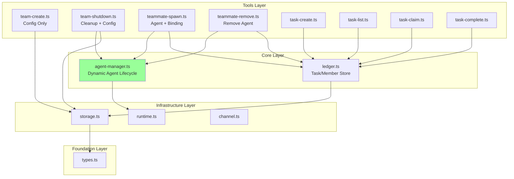
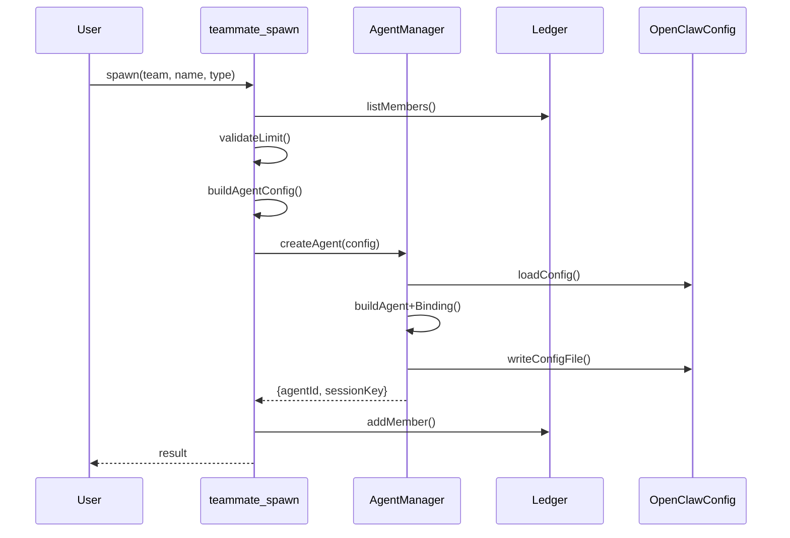
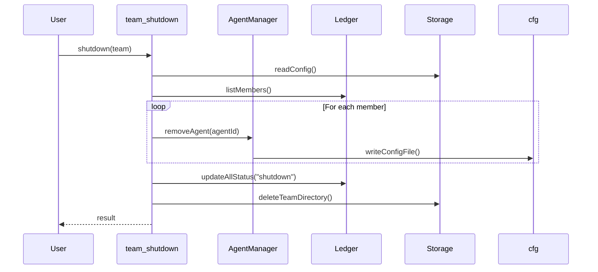

# Architecture

## Component Diagram



## File Structure

```
packages/openclaw-agent-team/src/
├── index.ts                    # Plugin entry point
├── types.ts                    # TypeBox schemas
│
├── core/
│   ├── ledger.ts              # Task/Member persistence
│   └── agent-manager.ts       # Dynamic agent lifecycle
│
├── channel/
│   └── agent-team-channel.ts  # Channel plugin
│
├── tools/
│   ├── team-create.ts         # Config only
│   ├── team-shutdown.ts       # Cleanup
│   ├── teammate-spawn.ts      # Create agent + binding
│   ├── teammate-remove.ts     # Remove agent + binding
│   ├── task-create.ts
│   ├── task-list.ts
│   ├── task-claim.ts
│   └── task-complete.ts
│
├── storage.ts                 # Path resolution
└── runtime.ts                 # PluginRuntime accessor
```

## Key Interfaces

### AgentManager

```typescript
// core/agent-manager.ts
import type { PluginRuntime } from "openclaw/plugin-sdk";

export interface DynamicAgentConfig {
  agentId: string;
  teamName: string;
  teammateName: string;
  agentType: string;
  workspace: string;
  agentDir: string;
  model?: string;
  tools?: { allow?: string[]; deny?: string[] };
}

export interface AgentManager {
  /**
   * Creates a dynamic agent with workspace, agentDir, and binding.
   * Uses runtime.config.writeConfigFile for atomic updates.
   */
  createAgent(config: DynamicAgentConfig): Promise<{
    agentId: string;
    sessionKey: string;
  }>;

  /**
   * Removes an agent and its binding from the config.
   */
  removeAgent(agentId: string): Promise<void>;

  /**
   * Lists all agents belonging to a team.
   */
  listTeamAgents(teamName: string): Promise<DynamicAgentConfig[]>;
}

export function createAgentManager(runtime: PluginRuntime): AgentManager;
```

### AgentManager Implementation

```typescript
// core/agent-manager.ts
import type { OpenClawConfig } from "openclaw/plugin-sdk";

const AGENT_ID_TEMPLATE = "teammate-{teamName}-{teammateName}";
const WORKSPACE_TEMPLATE = "~/.openclaw/teams/{teamName}/agents/{teammateName}/workspace";
const AGENT_DIR_TEMPLATE = "~/.openclaw/teams/{teamName}/agents/{teammateName}/agent";
const CHANNEL = "agent-team";

export function createAgentManager(runtime: PluginRuntime): AgentManager {
  return {
    async createAgent(config) {
      const cfg = await runtime.config.loadConfig();

      // Check if agent already exists
      const existingAgent = cfg.agents?.list?.find((a) => a.id === config.agentId);
      if (existingAgent) {
        // Agent exists - ensure binding exists
        const hasBinding = cfg.bindings?.some(
          (b) => b.agentId === config.agentId && b.match?.channel === CHANNEL
        );
        if (!hasBinding) {
          await this._addBinding(cfg, config);
        }
        return {
          agentId: config.agentId,
          sessionKey: `agent:${config.agentId}:main`,
        };
      }

      // Create new agent + binding
      const updatedCfg = this._buildUpdatedConfig(cfg, config);
      await runtime.config.writeConfigFile(updatedCfg);

      return {
        agentId: config.agentId,
        sessionKey: `agent:${config.agentId}:main`,
      };
    },

    async removeAgent(agentId: string) {
      const cfg = await runtime.config.loadConfig();

      const updatedCfg = {
        ...cfg,
        agents: {
          ...cfg.agents,
          list: (cfg.agents?.list ?? []).filter((a) => a.id !== agentId),
        },
        bindings: (cfg.bindings ?? []).filter((b) => b.agentId !== agentId),
      };

      await runtime.config.writeConfigFile(updatedCfg);
    },

    async listTeamAgents(teamName: string) {
      const cfg = await runtime.config.loadConfig();
      const prefix = `teammate-${teamName}-`;

      return (cfg.agents?.list ?? [])
        .filter((a) => a.id.startsWith(prefix))
        .map((a) => this._parseAgentConfig(a));
    },

    _buildUpdatedConfig(cfg: OpenClawConfig, config: DynamicAgentConfig) {
      return {
        ...cfg,
        agents: {
          ...cfg.agents,
          list: [
            ...(cfg.agents?.list ?? []),
            {
              id: config.agentId,
              workspace: config.workspace,
              agentDir: config.agentDir,
              ...(config.model && { model: { primary: config.model } }),
              ...(config.tools && { tools: config.tools }),
            },
          ],
        },
        bindings: [
          ...(cfg.bindings ?? []),
          {
            agentId: config.agentId,
            match: {
              channel: CHANNEL,
              peer: {
                kind: "direct",
                id: `${config.teamName}:${config.teammateName}`,
              },
            },
          },
        ],
      };
    },

    _addBinding(cfg: OpenClawConfig, config: DynamicAgentConfig) {
      const updatedCfg = {
        ...cfg,
        bindings: [
          ...(cfg.bindings ?? []),
          {
            agentId: config.agentId,
            match: {
              channel: CHANNEL,
              peer: {
                kind: "direct",
                id: `${config.teamName}:${config.teammateName}`,
              },
            },
          },
        ],
      };
      return runtime.config.writeConfigFile(updatedCfg);
    },

    _parseAgentConfig(agent: { id: string; workspace?: string; agentDir?: string }) {
      // Parse agentId: teammate-{teamName}-{teammateName}
      const match = agent.id.match(/^teammate-(.+)-(.+)$/);
      return {
        agentId: agent.id,
        teamName: match?.[1] ?? "",
        teammateName: match?.[2] ?? "",
        workspace: agent.workspace ?? "",
        agentDir: agent.agentDir ?? "",
      };
    },
  };
}
```

## Data Storage

### Team Directory Structure

```
~/.openclaw/teams/{team-name}/
├── config.json         # Team configuration
├── tasks.jsonl         # Task records
├── members.jsonl       # Team member records
├── dependencies.jsonl  # Task dependency records
└── agents/
    └── {teammateName}/
        ├── workspace/  # Teammate workspace
        └── agent/      # Teammate agent config
```

### Config.json Schema

```json
{
  "id": "uuid",
  "team_name": "my-team",
  "description": "Optional description",
  "agent_type": "team-lead",
  "lead": "coordinator",
  "metadata": {
    "createdAt": 1234567890,
    "updatedAt": 1234567890,
    "status": "active"
  }
}
```

## Sequence Diagrams

### Teammate Spawn



### Team Shutdown


