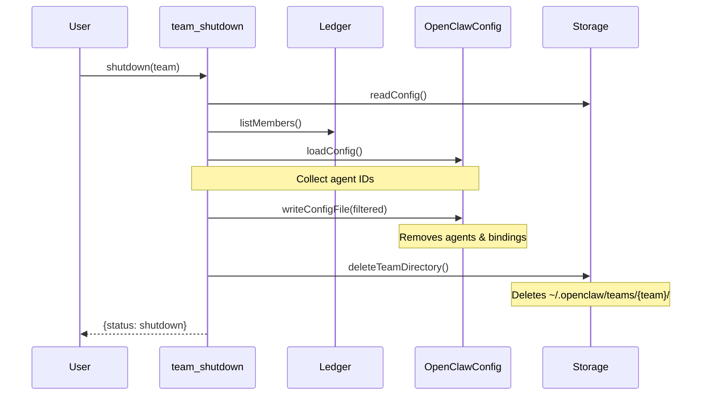

# openclaw-agent-team Plugin Simplified Refactor Design

## Context

The `openclaw-agent-team` plugin currently contains messaging functionality that duplicates OpenClaw core's `sessions_send` capability. This refactor aims to simplify the plugin by removing these duplicates and focusing on its core value: team coordination and task management.

## Problem Statement

| Current Issue | Solution |
|---------------|----------|
| `send_message` / `inbox` duplicate core's `sessions_send` | Remove, use core's messaging |
| `Mailbox` class duplicates core message storage | Delete |
| `teammate-invoker` / `reply-dispatcher` are complex workarounds | Delete, channel handles routing |
| `teammate_remove` tool adds complexity | Not needed, `team_shutdown` handles cleanup |

## Requirements

### Functional Requirements

| ID | Requirement | Priority |
|----|-------------|----------|
| R1 | `team_create` creates team config in `~/.openclaw/teams/{team}/config.json` | Must |
| R2 | `team_shutdown` removes agents/bindings from openclaw.json AND deletes team directory | Must |
| R3 | `teammate_spawn` creates agent + binding in openclaw.json | Must |
| R4 | Messaging uses core's `sessions_send` (tools removed) | Must |
| R5 | Task management (create, list, claim, complete) unchanged | Must |
| R6 | Keep minimal `agent-team` channel plugin for routing | Must |

### Non-Functional Requirements

| ID | Requirement | Priority |
|----|-------------|----------|
| NF1 | Config updates must be atomic (use `writeConfigFile`) | Must |
| NF2 | Cleanup must be complete (no orphaned agents/bindings) | Must |
| NF3 | Plugin code size should reduce by ~40% | Should |

## Rationale

### Why remove messaging tools?

OpenClaw core provides:
- `sessions_send` for point-to-point messaging
- `sessions_history` for viewing conversation history
- A2A negotiation flow via channel routing

The plugin's `Mailbox`, `send_message`, and `inbox` duplicate this with less functionality.

### Why not add `teammate_remove`?

- Simplicity: Only `team_shutdown` is needed for cleanup
- Use case: Teams are typically shut down as a whole, not individual teammates
- The current design already supports cleanup via `team_shutdown`

### Why keep channel plugin?

The `agent-team` channel plugin:
- Defines channel type and metadata
- Enables routing via bindings (`agent-team:teamName:teammateName`)
- Required for `sessions_send` to route messages to teammates

## Detailed Design

### Component Architecture

```
packages/openclaw-agent-team/src/
├── index.ts                    # Plugin entry point (modified)
├── types.ts                    # TypeBox schemas (remove message types)
├── ledger.ts                   # Task/Member persistence (keep)
├── storage.ts                  # Path resolution (add deleteTeamDirectory)
├── runtime.ts                  # PluginRuntime accessor (keep)
├── channel.ts                  # Minimal channel plugin (keep)
│
└── tools/
    ├── team-create.ts          # Config only (keep)
    ├── team-shutdown.ts        # Delete directory + clean config (modify)
    ├── teammate-spawn.ts       # Create agent + binding (keep)
    ├── task-create.ts          # (keep)
    ├── task-list.ts            # (keep)
    ├── task-claim.ts           # (keep)
    └── task-complete.ts        # (keep)
```

### Files to Delete

| File | Lines | Reason |
|------|-------|--------|
| `mailbox.ts` | ~180 | Messaging removed |
| `context-injection.ts` | ~80 | Messaging hook removed |
| `teammate-invoker.ts` | ~100 | Direct invocation removed |
| `reply-dispatcher.ts` | ~65 | Reply dispatch removed |
| `tools/send-message.ts` | ~195 | Messaging tool removed |
| `tools/inbox.ts` | ~115 | Inbox tool removed |

**Total: ~735 lines removed (~40% reduction)**

### Key Changes

#### 1. `team-shutdown.ts` - Enhanced Cleanup

```typescript
// After removing agents from config:
await runtime.config.writeConfigFile(updatedCfg);

// NEW: Delete team directory
await deleteTeamDirectory(ctx.teamsDir, team_name);
```

#### 2. `storage.ts` - New Function

```typescript
export async function deleteTeamDirectory(
  teamsDir: string,
  teamName: string
): Promise<void> {
  const teamDir = join(teamsDir, teamName);
  await rm(teamDir, { recursive: true, force: true });
}
```

#### 3. `index.ts` - Simplified Registration

Remove:
- `createSendMessageTool`, `createInboxTool` imports
- `createContextInjectionHook` import and export
- `invokeTeammate` export
- `send_message` and `inbox` tool registrations
- `before_prompt_build` hook registration

#### 4. `types.ts` - Remove Message Types

Remove:
- `TeamMessageSchema`
- `TeamMessageTypeSchema`
- `SendMessageParamsSchema`
- Related type exports

## Data Flow

### Team Shutdown (Enhanced)



## Migration Path

| Phase | Actions |
|-------|---------|
| 1 | Add `deleteTeamDirectory()` to `storage.ts` |
| 2 | Update `team-shutdown.ts` to delete directory |
| 3 | Delete `mailbox.ts`, `context-injection.ts`, `teammate-invoker.ts`, `reply-dispatcher.ts` |
| 4 | Delete `tools/send-message.ts`, `tools/inbox.ts` |
| 5 | Remove message types from `types.ts` |
| 6 | Update `index.ts` (remove tool registrations, hooks, exports) |
| 7 | Delete related test files |
| 8 | Run all tests |

## Success Criteria

- [ ] All existing tests pass
- [ ] `team_shutdown` deletes team directory
- [ ] `team_shutdown` removes all agents & bindings from openclaw.json
- [ ] Messaging works via `sessions_send` through agent-team channel
- [ ] Code size reduced by ~40%

## Design Documents

- [BDD Specifications](./bdd-specs.md) - Behavior scenarios and testing strategy
- [Architecture](./architecture.md) - System architecture and component details
- [Best Practices](./best-practices.md) - Security, performance, and code quality guidelines
