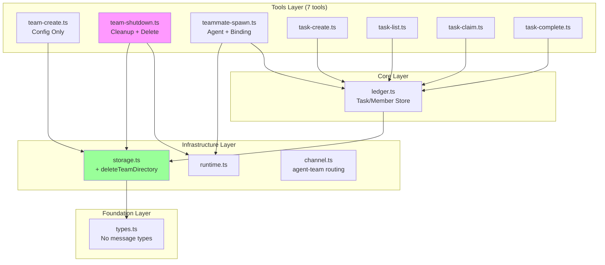
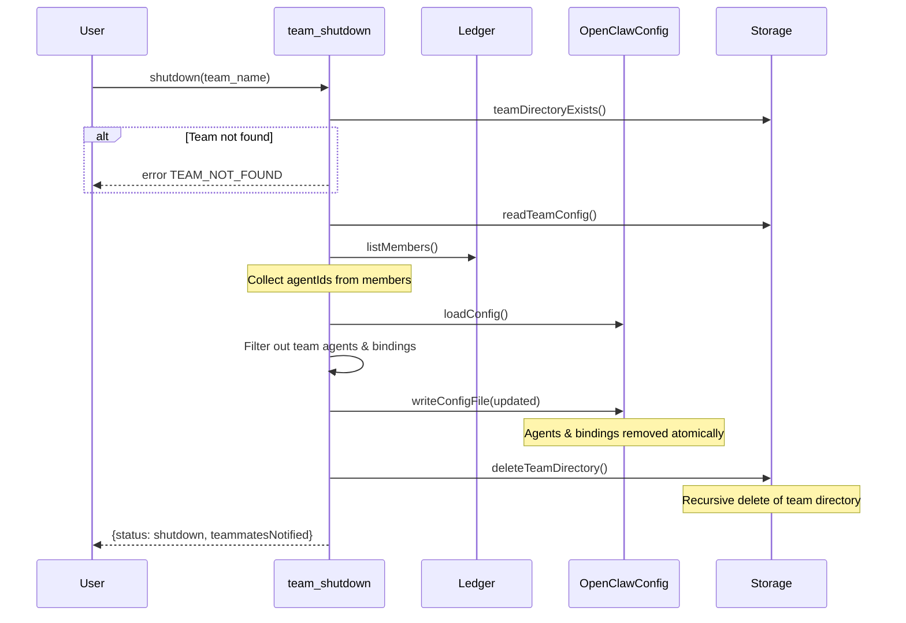
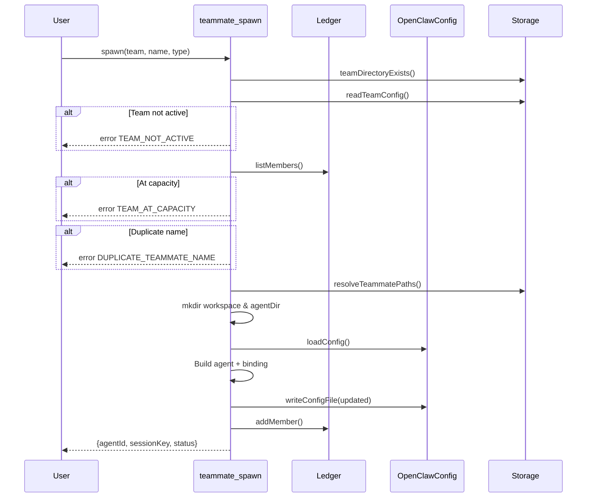

# Architecture

## Component Diagram



## File Structure

### Before Refactor

```
packages/openclaw-agent-team/src/
├── index.ts
├── types.ts
├── ledger.ts
├── mailbox.ts                    # DELETE
├── context-injection.ts          # DELETE
├── teammate-invoker.ts           # DELETE
├── reply-dispatcher.ts           # DELETE
├── storage.ts
├── runtime.ts
├── channel.ts
└── tools/
    ├── team-create.ts
    ├── team-shutdown.ts
    ├── teammate-spawn.ts
    ├── task-create.ts
    ├── task-list.ts
    ├── task-claim.ts
    ├── task-complete.ts
    ├── send-message.ts           # DELETE
    └── inbox.ts                  # DELETE
```

### After Refactor

```
packages/openclaw-agent-team/src/
├── index.ts                      # Modified: remove messaging
├── types.ts                      # Modified: remove message types
├── ledger.ts                     # Unchanged
├── storage.ts                    # Modified: add deleteTeamDirectory
├── runtime.ts                    # Unchanged
├── channel.ts                    # Unchanged
└── tools/
    ├── team-create.ts            # Unchanged
    ├── team-shutdown.ts          # Modified: add directory deletion
    ├── teammate-spawn.ts         # Unchanged
    ├── task-create.ts            # Unchanged
    ├── task-list.ts              # Unchanged
    ├── task-claim.ts             # Unchanged
    └── task-complete.ts          # Unchanged
```

## Key Interface Changes

### Removed Interfaces

| Interface | File | Reason |
|-----------|------|--------|
| `TeamMessage` | types.ts | Messaging removed |
| `SendMessageParams` | types.ts | Messaging tool removed |
| `Mailbox` | mailbox.ts | Messaging removed |
| `ContextInjectionContext` | context-injection.ts | Hook removed |
| `InvokeTeammateParams` | teammate-invoker.ts | Direct invocation removed |
| `CreateAgentTeamReplyDispatcherParams` | reply-dispatcher.ts | Reply dispatch removed |

### New Functions

```typescript
// storage.ts
export async function deleteTeamDirectory(
  teamsDir: string,
  teamName: string
): Promise<void>;
```

### Modified Functions

```typescript
// team-shutdown.ts - Enhanced to delete directory
async function handler(params: TeamShutdownParams) {
  // ... existing logic to remove agents/bindings ...

  // NEW: Delete team directory
  await deleteTeamDirectory(ctx.teamsDir, team_name);

  return { status: "shutdown", ... };
}
```

## Sequence Diagrams

### Team Shutdown (Enhanced)



### Teammate Spawn (Unchanged)



## Data Storage

### Team Directory Structure (After Refactor)

```
~/.openclaw/teams/{team-name}/
├── config.json         # Team configuration
├── ledger.db           # SQLite: tasks, members, dependencies
└── agents/
    └── {teammateName}/
        ├── workspace/  # Teammate workspace
        └── agent/      # Teammate agent config
```

**Note:** `inbox/` directory is no longer created after refactor.

### Config.json Schema (Unchanged)

```json
{
  "id": "uuid",
  "team_name": "my-team",
  "description": "Optional description",
  "agent_type": "team-lead",
  "lead": "coordinator",
  "metadata": {
    "createdAt": 1234567890,
    "updatedAt": 1234567890,
    "status": "active"
  }
}
```

### OpenClaw Config Bindings (Unchanged)

```json
{
  "bindings": [
    {
      "agentId": "teammate-my-team-researcher",
      "match": {
        "channel": "agent-team",
        "peer": {
          "kind": "direct",
          "id": "my-team:researcher"
        }
      }
    }
  ]
}
```

## Tool Count Comparison

| Category | Before | After |
|----------|--------|-------|
| Team Management | 2 | 2 |
| Teammate Management | 1 | 1 |
| Task Management | 4 | 4 |
| Messaging | 2 | 0 |
| **Total** | **9** | **7** |
